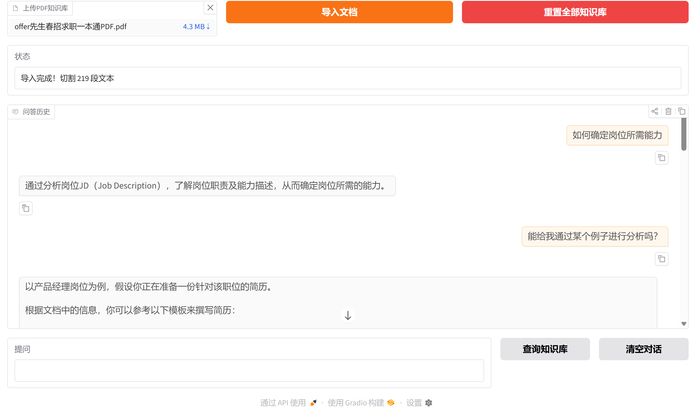

[TOC]

Q：元数据管理能否将用metadata_store列表存储改为用Redis等数据库存储？——ChormaDB是否直接解决了这件事情，而不像Faiss一样还需要额外的数据库来存储和管理metadata？


#  Ollama + LangChain 本地私有化PDF RAG可视化Demo

 纯本地离线知识库问答工具，Gradio可视化网页，不上传任何数据到外网，支持PDF本地向量存储。



## 技术栈

Ollama (本地大模型 + 嵌入) + LangChain (RAG 链路) + Chroma (本地向量库) + Gradio (网页 UI)

## 整体架构

1. 启动初始化 → 2. 上传 PDF 并构建向量知识库 → 3. 用户提问检索知识库回答 → 4. 重置 / 清空功能

## 功能亮点 

1. 可视化网页界面，无需前端开发 
2. 本地向量持久化存储，重启程序无需重复解析PDF 
3. 切换主题/页面刷新不会丢失问答历史 
4. 强约束提示词，AI仅基于PDF内容回答，杜绝幻觉编造 5. 自动缓存上传PDF文件，无需重复上传文档

## 环境前置要求 

1. 本地安装 Ollama 客户端：https://ollama.com/download 

2.  拉取必需模型（终端执行） 

   ```bash
    ollama pull qwen2.5:7b 
    ollama pull nomic-embed-text
   ```


******

# 关于依赖

`pigar generate .`

## 导出当前虚拟环境的全部包

`pip freeze > requirements.txt`:
pip freeze 缺点：会导出虚拟环境所有安装包（含测试、无用包）

## 导出实际上用到的包

pipreqs 扫描项目代码，仅记录代码里 import 用到的依赖。

### 1. 基础生成命令

进入**项目根目录**（有所有 py 文件的文件夹）运行：

```bash
pipreqs .
```

执行后自动生成 `requirements.txt`

### 2. 常用实用参数

#### ① 覆盖已有旧文件（必用）

重复执行时报文件存在，加 `--force` 覆盖：

```bash
pipreqs . --force
```

#### ② 解决中文路径 / 中文注释乱码报错

```bash
pipreqs . --force --encoding=utf8
```

#### ③ 排除文件夹（venv、缓存、打包目录）

不扫描虚拟环境、缓存、编译文件夹，减少误识别：

```bash
pipreqs . --force --encoding=utf8 --exclude=venv,__pycache__,dist,build,logs
```

#### ④ 指定输出文件路径

不想生成在当前目录，可以自定义位置：

```bash
pipreqs . --force --savepath ./config/requirements.txt
```

## 他人安装依赖

拿到你的 requirements.txt 后，新建虚拟环境执行：

```bash
pip install -r requirements.txt
```